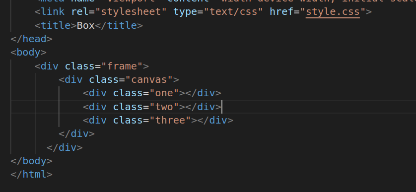
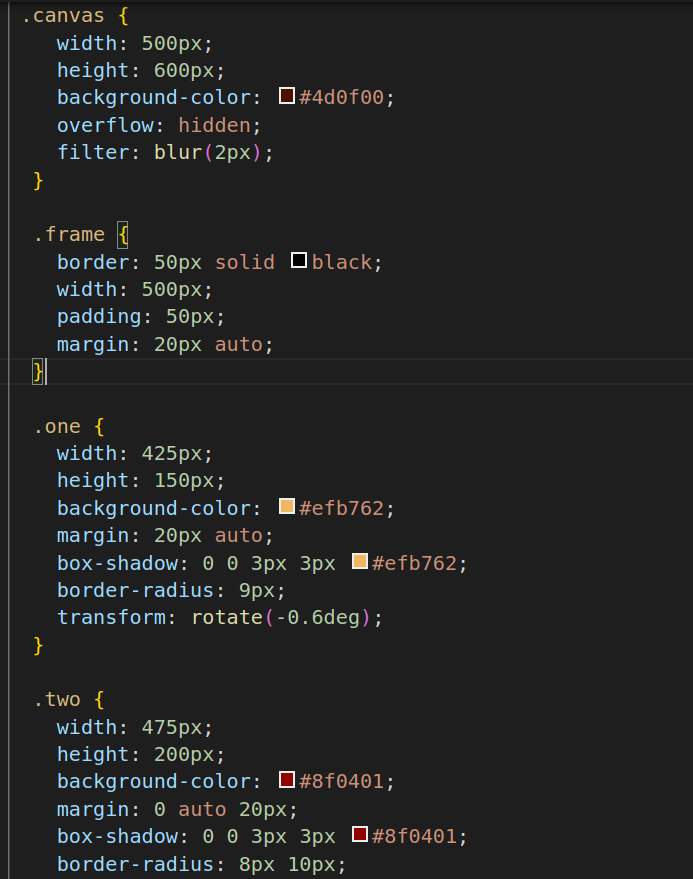
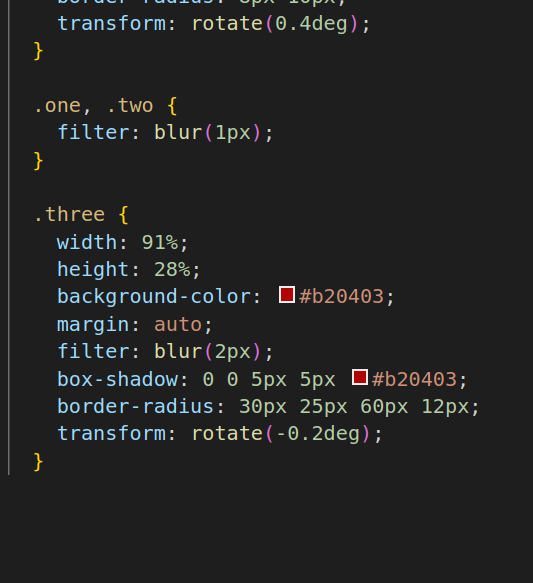

# Box Model
1.
* link:Purpose: Links an external CSS stylesheet to the HTML document.
Explanation: This tag is used to import external styles from a CSS file named "style.css" into the HTML document. It allows you to apply styling rules to the HTML content.
* The div class="frame":
Purpose: Creates a container or division with the class "frame."
Explanation: The div element is a generic container used to group and structure content. In this case, it forms a "frame" around other elements.
* div class="canvas":Purpose: Creates another container or division with the class "canvas."
* Explanation: Similar to the previous div, this one acts as a "canvas" and contains more specific content or elements.
* The div class="one", div class="two", div class="three":
Purpose: These create three div elements with different classes ("one," "two," and "three").
* Explanation: These div elements can be used to structure and style content, apply specific CSS rules, or hold individual pieces of content within the "canvas."

2.

3.
* canvas Selector:width, height:
* width sets the width of the .canvas element to 500 pixels.
* height sets the height of the .canvas element to 600 pixels.
* Purpose: These properties define the dimensions of the canvas element.
* background-color:Sets the background color of the .canvas element to a dark red-brown.
* Purpose: This property defines the background color of the canvas.
* overflow: hidden:overflow hides any content that overflows the boundaries of the .canvas element.
* Purpose: It ensures that any content or child elements that extend beyond the canvas's dimensions are not visible.
* filter: blur(2px):
Applies a blur effect to the content inside the .canvas element.
* Purpose: It blurs the content within the canvas, creating a visual effect.
* frame Selector:border:
Sets a solid black border around the .frame element with a thickness of 50 pixels.
* Purpose: This property creates a thick border around the frame element.
* width:Sets the width of the .frame element to 500 pixels.
* Purpose: It defines the width of the frame.
* padding:Adds 50 pixels of padding inside the .frame element.
* Purpose: Padding creates space between the border and the content within the frame.
* margin:Sets a margin of 20 pixels on all sides of the .frame element and centers it horizontally using auto.
* Purpose: It positions the frame in the center of the page with a margin around it.
* one and two Selectors:
width, height, background-color, margin, box-shadow, border-radius,transform:These properties define the styling for the elements with classes .one and .two.
* Purpose: They set the dimensions, background color, margin, box shadow, border radius, and rotation for these elements.
* filter: blur(1px) (Applied to both .one and .two):Applies a 1-pixel blur effect to both elements.
* Purpose: It blurs the content within .one and .two elements, creating a subtle visual effect.
* three Selector:width, height, background-color, margin, filter, box-shadow, border-radius, transform:
These properties define the styling for the element with class .three.
* Purpose: They set the dimensions, background color, margin, filter effect, box shadow, border radius, and rotation for this element.
